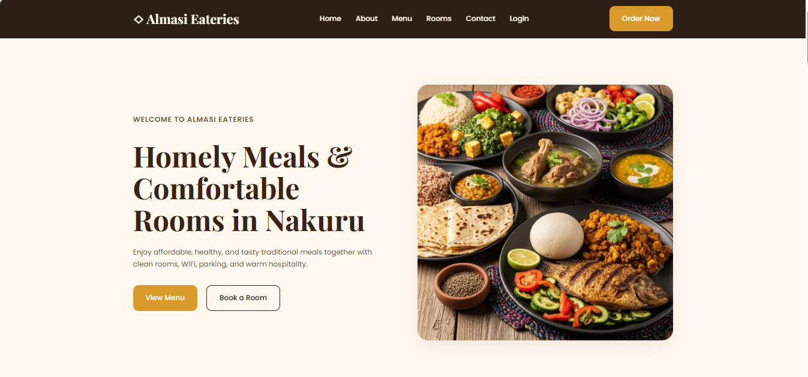
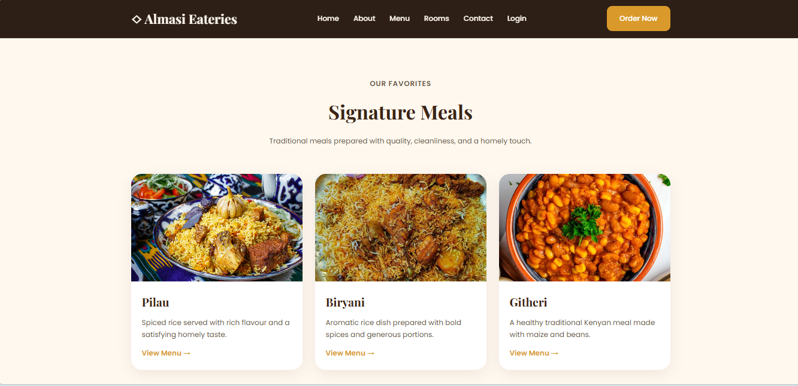
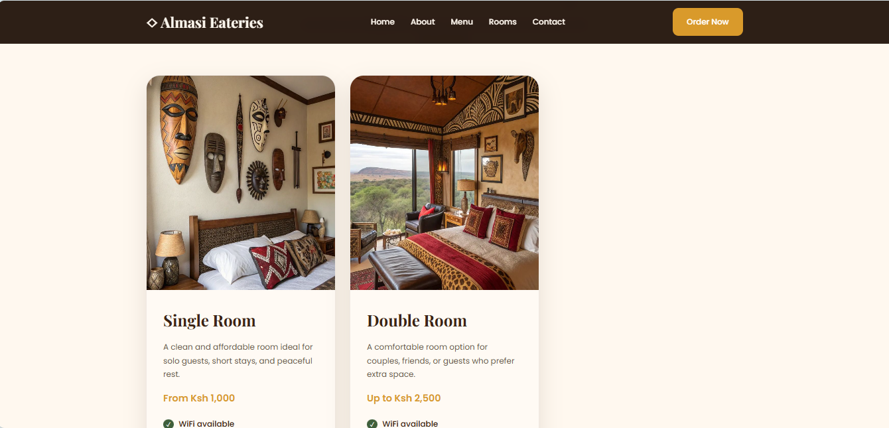
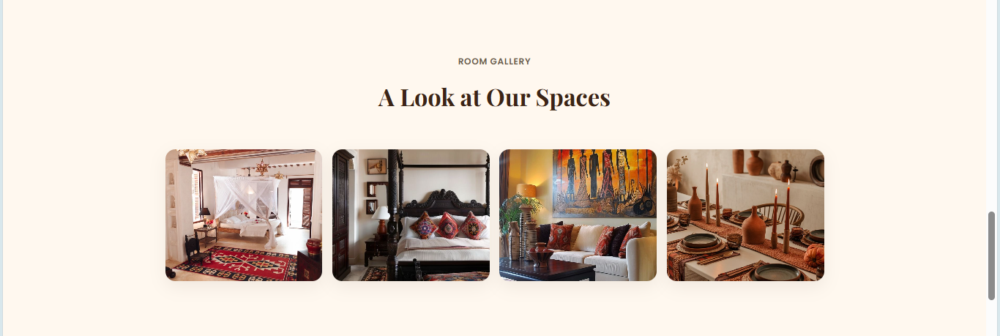

# Almasi-Eateries

## Overview

Almasi-Eateries is a responsive hospitality website designed to establish a modern online presence for an upcoming business located in Nakuru Town, Kenya.

The website showcases both restaurant and accommodation services, allowing customers to explore signature meals, room options, amenities, contact information, and ordering or booking options through phone calls and WhatsApp.

The overall design direction focuses on creating a warm, traditional, homely, and professional digital experience while highlighting affordable hospitality and quality customer service.

---

# Features

- Responsive homepage design
- Navigation bar with quick links
- Hero section with call-to-action buttons
- Weekly food offers section
- Signature meals showcase
- Rooms and accommodation section
- Services and amenities section
- Gallery section
- Contact and location section
- WhatsApp integration
- Call buttons for direct communication
- Social media integration
- Mobile-friendly responsive layouts
- Organized project structure
- Professional hospitality branding

---

# Business Information

## Business Name
Almasi-Eateries

## Slogan
Affordable, Healthy, Tasty Meals

## Location
Nakuru Town, kenya.


# Design Goals

The website was designed to:

- Create a welcoming and homely experience
- Represent traditional hospitality and food culture
- Make ordering and booking easier for customers
- Improve the business's online visibility
- Showcase food and accommodation services clearly
- Ensure accessibility across desktop and mobile devices

---

# Design Inspiration & Research

The project included:

- Competitor analysis of hospitality websites
- UI/UX research for restaurant and hotel platforms
- Responsive layout planning

The design direction focused on:

- Traditional hospitality
- Warm earthy color palettes
- Clean layouts
- Comfortable spacing
- Readable typography
- User-friendly navigation

---

# Color Palette

| Purpose | Hex Code |
|---|---|
| Cream Background | #FFF8EF |
| Warm Brown | #3B2416 |
| Amber Gold | #D99A2B |
| Deep Green | #3F5F3B |
| Soft Beige | #F3E5D0 |
| Dark Footer | #24160E |

---


# Technologies Used

- HTML5
- CSS3
- Flexbox
- CSS Grid
- Media Queries
- Git & GitHub
- Vercel

---

# Project Structure

```txt
│   about.html
│   auth.html
│   contact.html
│   create-account.html
│   index.html
│   LICENSE
│   login.html
│   menu.html
│   README.md
│   rooms.html
│   
├───.vscode
│       settings.json
│       
├───assets
│   └───images
│           about-restaurant.jpg
│           accomadationspace.jpg
│           bedsetup.jpg
│           biryani.jpg
│           chapati-beef.jpg
│           double-room.jpg
│           gallery-screenshot.png
│           githeri.jpg
│           herosection-screenshot.png
│           mukimo.jpg
│           pilau.jpg
│           room-interior.jpg
│           room-screenshot.png
│           room.jpg
│           roomservice.jpg
│           signaturemeals-screenshot.png
│           single-room.jpg
│           traditionalmeal.jpg
│           ugali-fish.jpg
│           
└───css
        style.css
        
```

---


# Website Sections

## 1. Navbar

Contains:
- Logo
- Navigation links
- Order/Booking button

---

## 2. Hero Section


---

## 3. Weekly Offers Section

Showcases:
- Daily food promotions
- Combo meals
- Special discounts

---

## 4. Signature Meals Section



---

## 5. Rooms Section


---

## 6. Services Section

Highlights:
- WiFi
- Parking
- Room service
- Delivery
- Dine-in
- Takeaway

---

## 7. Gallery Section



---

## 8. Contact Section

Includes:
- Phone numbers
- WhatsApp integration
- TikTok information
- Location details

---

## 9. Footer

Contains:
- Quick links
- Branding
- Contact information
- Social media links

---

# Responsive Design

The website is designed to work across:

- Mobile devices
- Tablets
- Laptops
- Desktop screens

Responsive techniques used include:

- Flexible containers
- CSS Grid layouts
- Flexbox alignment
- Media queries
- Responsive typography
- Responsive image sizing

---

# WhatsApp Integration

The website integrates direct WhatsApp communication to allow customers to:

- Place food orders
- Inquire about rooms
- Contact the business quickly

---


# Setup Instructions

## 1. Clone the Repository

```bash
git clone https://github.com/wanjiruaisha/almasi-eateries-hotel.git
```

## 2. Navigate Into the Project Folder

```bash
cd almasi-Eateries
```

## 3. Open the Project

Open the project using:

- VS Code
- Live Server
- Any modern browser

---

# Contributions & Collaboration

Contributions, feedback, and collaborative ideas are welcome to help improve the website design, responsiveness, accessibility, and overall user experience.

Areas open for collaboration include:

- UI/UX improvements
- Responsive design optimization
- Accessibility enhancements
- Hospitality branding ideas
- Menu and booking system expansion
- Frontend performance optimization
- Future backend integration

## To Contribute:

1. **Fork the Repository:** Create your own copy of the project to work on.

2. **Create a Feature Branch:**
```bash
git checkout -b feature/AmazingFeature
```

3. **Commit Your Changes:**

```bash
    git commit -m 'Add some AmazingFeature'
```
4.  **Push to the Branch:**
```bash
    git push origin feature/AmazingFeature
```
5.  **Open a Pull Request:** Describe your changes and submit for review.


# Future Improvements

Potential future upgrades include:

- Online booking system
- Dynamic menu filtering
- Shopping cart functionality
- Customer review system
- Google Maps integration
- Backend integration
- Admin dashboard
- Facebook page integration
- Online payment systems
- Dark mode
- Search functionality
- Animated transitions
- Food ordering dashboard
- Customer reservation forms

---

# Deployment

The website can be deployed using:

- GitHub Pages
- Vercel

---

# Contact Information

## Phone Numbers

- 0713968080
- 0726829468

## WhatsApp

0713968080

## TikTok

Almasi-Eateries

## Facebook

The Almasi-Eateries (Coming Soon)

---

# Credits

## Business Information

Almasi-Eateries

## Design & Development

Aisha Wanjiru

---

# License
This project is licensed under the MIT License.
